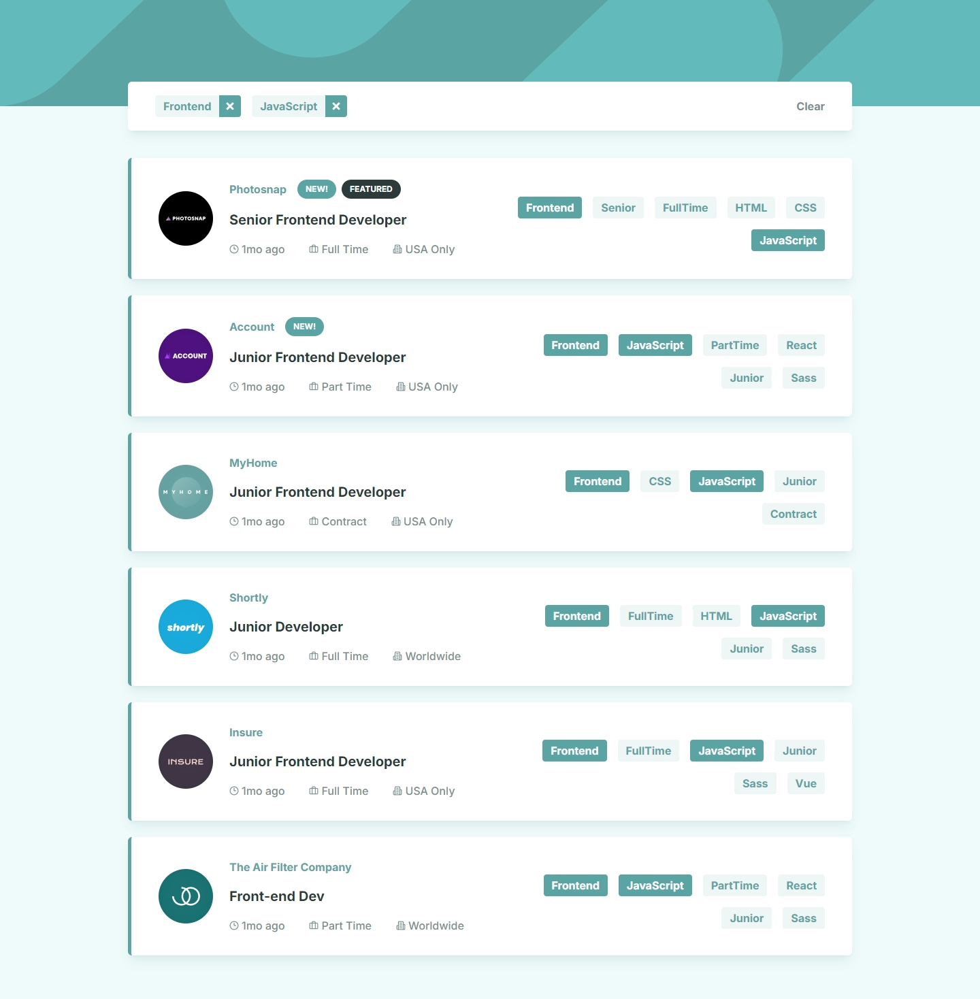
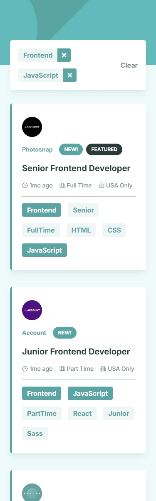

## Frontend Mentor Challenge 31 - Job Listings with Filtering

This is my solution to the [Job Listings with Filtering](https://www.frontendmentor.io/challenges/job-listings-with-filtering-ivstIPCt) challenge on [Frontend Mentor](https://www.frontendmentor.io/).

#

### Links 🔗

- Live Site URL: https://job-listings-with-filtering-darkstar.vercel.app/

#

### Built with 🔨

- Next.js
- TypeScript
- Tailwind
- React Aria Components
- Prisma ORM
- Prisma Postgres
- Motion

#

### Features ✨

- Fetch and display jobs from the database.
- Filter displayed jobs by tags on the client.
- Dynamic routes for each company and job detail page.
- Dynamic page titles using `generateMetadata`.

#

### Screenshots of the Solution (Desktop & Mobile) 🔍

#

- My Frontend Mentor profile - [@DarkstarXDD](https://www.frontendmentor.io/profile/DarkstarXDD)
